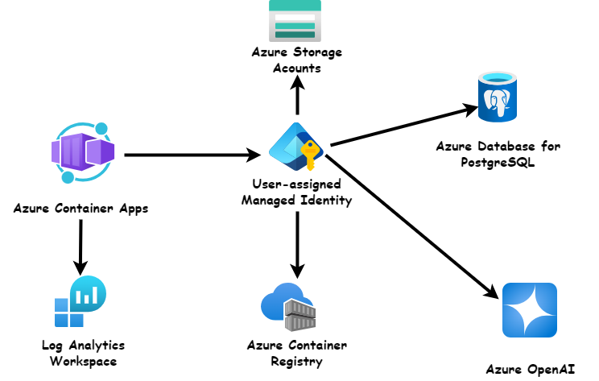

# 📚 Bic Rouge an LLM Assignment Grading and Feedback Generation System

## Project Overview

This project is a platform that leverages Large Language Models (LLMs) to automate assignment grading, generate personalized feedback, and assist teachers with assignment and course composition. It is specifically designed to support educators managing large class sizes and addressing resource constraints.

The platform integrates:

A Web Application: Built with Python (FastAPI) for the backend and React for the frontend.
A Mobile Application: Developed using Flutter for an intuitive and user-friendly experience.
Cutting-Edge Models: Powered by advanced LLMs like LLAMA and GPT-3.5 Turbo to ensure accuracy, scalability, and efficiency.
By combining modern AI technologies with practical features, this project aims to streamline teaching processes and enhance the learning experience for students.

## 🛠 Tech Stack

- **Backend**: Python with FastAPI
- **Frontend**: Javascript with React.js and Tailwind
- **Mobile**: Flutter
- **LLM**: GPT-3.5 Turbo and LLAMA-3 8B instruct models

## 🎨 Design


## 🏗 Architecture



## 🚀 Deployment

The deployment will be executed on Azure, utilizing Azure Container Services and Azure OpenAI. The process will leverage Docker, CI/CD pipelines, and GitHub Actions to ensure seamless integration, scalability, and automation.

## ✨ Features

- **Assignment Scoring**: The application uses LLM to score assignments based on predefined criteria.
- **Feedback Generation**: It also generates feedback for each assignment, providing students with valuable insights into their performance.
- **Teacher Support**: The application is designed to reduce the workload of teachers by automating the scoring and feedback process.

## 🏁 Getting Started

To get a local copy up and running, follow these steps:

### ⚙️ Backend (FastAPI)

1. Clone the repo

   ```sh
   git clone git@github.com:Ashuza11/AI_Project_BicRouge.git

   ```

2. Navigate to the backend directory

   ```sh
   cd BicRouge-Web/backend

   ```

3. Create a virtual environment

   ```sh
   python -m venv env

   ```

4. Activate the virtual environment

   - On Windows:

   ```sh
   .\env\Scripts\activate
   ```

   - On macOS/Linux

   ```sh
   .\env\Scripts\activate

   ```

5. Install the required packages

   ```sh
   pip install -r requirements.txt

   ```

6. Add your API keys in the `.env` file

   ```sh
      SECRET_KEY=your_secret_key
      OPENAI_API_KEY=your_openai_api_key
      GITHUB_API_KEY=your_github_api_key
      AZURE_OPENAI_API_KEY=your_azure_openai_api_key
      AZURE_OPENAI_ENDPOINT=your_azure_openai_endpoint
      AZURE_OPENAI_DEPLOYMENT_NAME=your_azure_openai_deployment_name
   ```

7. Run the FastAPI server

   ```sh
   uvicorn app.main:app --reload

   ```

### 🌐 Frontend (React with Vite and Tailwind)

1. Navigate to the frontend directory

   ```sh
   cd BicRouge-Web/frontend

   ```

2. Install NPM packages

   ```sh
   npm install

   ```

3. Run the app

   ```sh
   npm run dev

   ```

### 📱 Mobile (Flutter)

1. Ensure you have Flutter installed. Follow the instructions [here](https://docs.flutter.dev/get-started/install) if you don't have it installed.

2. Navigate to the mobile app directory

   ```sh
   cd BicRouge-Mobile

   ```

3. Get the Flutter packages

   ```sh
   flutter pub get

   ```

4. Run the app

   ```sh
   flutter run

   ```

## 🎥 Project Demo Video

[View the Demo](https://youtu.be/2uEd4X6gMOw)

## 🤝 Contributing

1. Fork the Project
2. Create your Feature Branch (`git checkout -b feature/AmazingFeature`)
3. Commit your Changes (`git commit -m 'Add some AmazingFeature'`)
4. Push to the Branch (`git push origin feature/AmazingFeature`)
5. Open a Pull Request

## 📜 License

Distributed under the MIT License. See `LICENSE` for more information.

## 📧 Contact

Muhigiri Ashuza @Team-maarifa - ashuzamh@gmail.com
